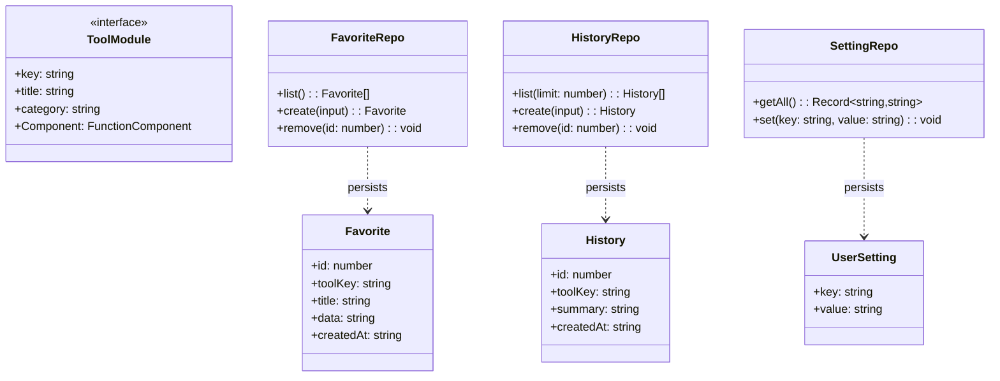
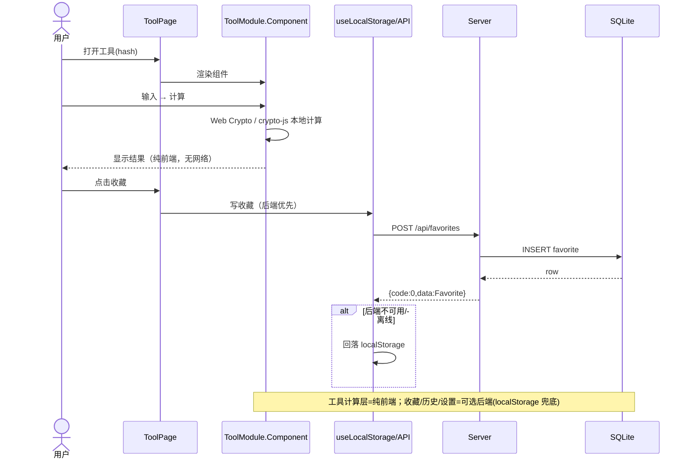
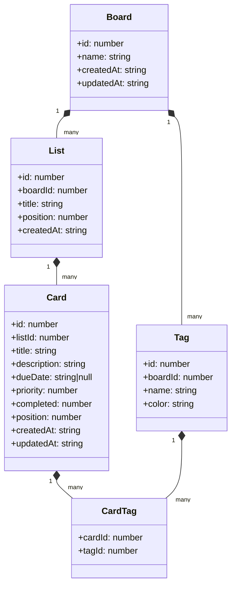
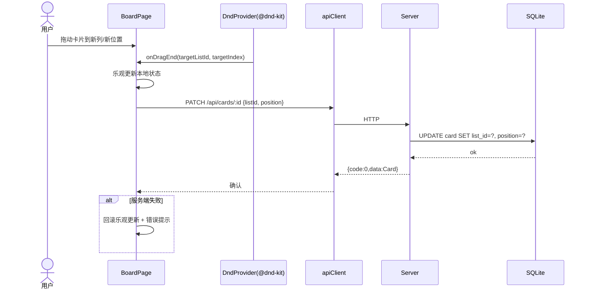
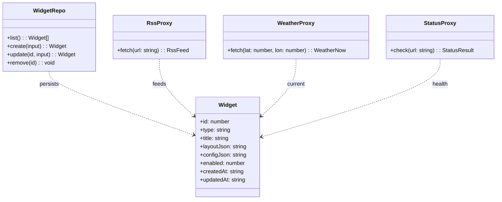
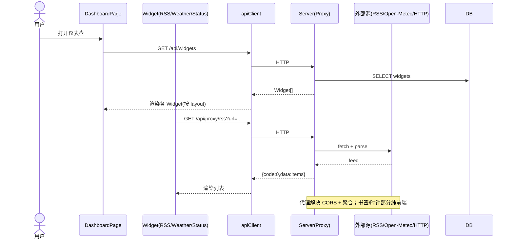

# B1 架构设计与任务分解（软件开发团队 · 架构师 高见远 / Gao）

> 面向工程师：**寇豆码**。本文档为 B1 批次（3 个 app）的可执行规格，信息密度高、无赘述。
> 批次范围：B1 = `it-tools`（开发者工具箱）、`kanban`（任务/看板）、`glance`（信息聚合仪表盘）。
> 全栈要求：前端 `Vite + React + MUI + Tailwind`；后端 `Node + Express + SQLite（better-sqlite3）`。
> 目标：三 app 复用同一套前端脚手架与后端模板，降低 B2–B4（后续 9 个 app）成本。

---

## 0. 总览与统一仓库结构

### 0.1 目录组织（B1–B4 可平滑扩展）

```
software-clones/
├── README.md                      # 总入口：如何跑每个 app、端口表、约定
├── shared/                        # 共享脚手架（复制起点，非运行时依赖）
│   ├── frontend-template/         # Vite + React + MUI + Tailwind 模板
│   └── backend-template/          # Node + Express + better-sqlite3 + TS 模板
├── it-tools/                      # App1 开发者工具箱
│   ├── client/                    # 前端（Vite 工程，独立 package.json）
│   └── server/                    # 后端（Express 工程，独立 package.json）
├── kanban/                        # App2 任务/看板
│   ├── client/
│   └── server/
└── glance/                        # App3 信息聚合仪表盘
    ├── client/
    └── server/
```

- **每个 app 自包含**：`client/` 与 `server/` 各有独立 `package.json`，互不耦合，可独立 `install`/`dev`/`build`，便于 B2+ 并行加入而不冲突。
- **shared/ 用途**：作为新 app 的"复制起点"（copy-start），保证脚手架一致。B1 各 app 直接从模板复制后做最小化改造。**不**通过 monorepo workspace 共享运行时（避免 B2+ 升级互相影响）；若后续需要，可升级为 pnpm workspace 的 `shared-ui` / `shared-server` 包（见 §5 待明确）。
- **数据文件**：各 app 的 SQLite 文件落在 `<app>/server/data/app.db`，加入各自 `.gitignore`。

### 0.2 共享脚手架内容（frontend-template / backend-template）

`shared/frontend-template`（后续每个 client 即此模板 + 业务目录）：
```
frontend-template/
├── package.json            # react, react-dom, react-router-dom, @mui/*, emotion, tailwindcss, vite, ts
├── vite.config.ts
├── tsconfig.json
├── tsconfig.node.json
├── tailwind.config.js
├── postcss.config.js
├── index.html
├── .env                    # VITE_API_BASE=http://localhost:<BE_PORT>/api
└── src/
    ├── main.tsx
    ├── App.tsx
    ├── theme.ts            # MUI 主题（统一品牌色/圆角/字体）
    ├── router.tsx          # react-router 路由表（占位）
    ├── layouts/MainLayout.tsx   # 顶栏 + 侧栏 + <Outlet/>
    ├── components/ErrorBoundary.tsx
    ├── api/client.ts       # fetch 封装：统一 baseURL、错误信封解析、401 处理
    ├── hooks/useLocalStorage.ts
    └── styles/global.css   # tailwind 指令 + 全局样式
```

`shared/backend-template`（后续每个 server 即此模板 + 业务路由/仓储）：
```
backend-template/
├── package.json            # express, cors, dotenv, better-sqlite3, typescript, tsx, @types/*
├── tsconfig.json
├── .env.example            # PORT=410X, CORS_ORIGIN=http://localhost:517X
└── src/
    ├── index.ts            # bootstrap：listen(PORT)
    ├── app.ts             # express() + 中间件 + /api 路由挂载
    ├── db.ts              # better-sqlite3 连接 + schema.sql 自动初始化
    ├── schema.sql         # DDL（建表 + 版本表）
    ├── middleware/
    │   ├── errorHandler.ts # 统一错误信封 {code,message,data:null}
    │   ├── notFound.ts     # 404 → 错误信封
    │   └── asyncHandler.ts # 包裹 async 路由，错误透传
    └── routes/
        └── health.ts       # GET /api/health → {code:0,data:{ok:true}}
```

### 0.3 统一技术决策

| 决策点 | 结论 | 理由 |
|---|---|---|
| 语言 | **TypeScript 全栈（strict）** | 类型安全，前后端 DTO 一致，降低联调成本 |
| 前端框架 | Vite + React 18 + MUI 5 + Tailwind 3 | 默认栈；MUI 出组件快，Tailwind 做布局微调 |
| 后端框架 | Express 4 | 轻量、生态成熟、模板统一 |
| **SQLite 选型** | **better-sqlite3（同步）** | 三 app 数据模型简单（单库单文件）；同步 API 减少 async 样板；零运维。Prisma 偏重（异步/engine/迁移），B1 不引入；若 B2+ 出现强关系复杂度再评估 |
| 状态管理 | React 内置（useState/useReducer + 自定义 hooks） | 三 app 规模小，无需 Redux/Zustand |
| 拖拽 | `@dnd-kit/core` + `@dnd-kit/sortable`（仅 kanban） | 现代、轻量、TS 友好 |
| 仪表盘网格 | `react-grid-layout`（仅 glance） | 类 Glance 的可拖拽网格 |
| 外部 API | Glance 代理走后端；天气用 **Open-Meteo（免 key）** | 免密钥、CORS 友好，后端代理规避浏览器跨域 |

**端口分配表（避免 B2+ 冲突，统一 41xx 后端 / 517x 前端）**

| App | 前端(dev) | 后端 | VITE_API_BASE |
|---|---|---|---|
| it-tools | 5173 | 4101 | http://localhost:4101/api |
| kanban | 5174 | 4102 | http://localhost:4102/api |
| glance | 5175 | 4103 | http://localhost:4103/api |

### 0.4 跨 App 共享约定

- **API 前缀**：各后端以 `/api` 为根；前端经 `VITE_API_BASE` 注入基址，不写死。
- **响应信封**（全栈统一）：
  - 成功：`{ "code": 0, "message": "ok", "data": <T> }`
  - 失败：`{ "code": <非零>, "message": "<人类可读>", "data": null }`
  - HTTP 状态码与 `code` 并存（4xx/5xx 对应业务码）。
- **错误码表**：

  | code | 含义 | HTTP |
  |---|---|---|
  | 0 | 成功 | 200 |
  | 40000 | 参数/请求体错误（通用） | 400 |
  | 40001 | 字段校验失败 | 400 |
  | 40100 | 未认证（预留） | 401 |
  | 40300 | 无权限（预留） | 403 |
  | 40400 | 资源不存在 | 404 |
  | 40900 | 冲突（如唯一约束） | 409 |
  | 50000 | 服务器内部错误 | 500 |
  | 50200 | 上游代理失败（glance 专用） | 502 |

- **命名约定**：
  - 路由：`kebab-case`，资源用复数（`/api/boards`、`/api/cards`）。
  - JSON 字段：`camelCase`（`dueDate`、`createdAt`）。
  - DB 列：`snake_case`（`due_date`、`created_at`）。
  - React 组件 / 文件：`PascalCase.tsx`；工具函数文件：`kebab-case.ts`；常量：`UPPER_SNAKE_CASE`。
- **时间戳**：一律 **ISO 8601 UTC 字符串**（如 `2025-07-22T12:00:00.000Z`），DB 存 `TEXT`，JSON 同形。
- **CORS**：后端 `cors({ origin: process.env.CORS_ORIGIN })`，开发期允许前端 origin。
- **认证**：B1 默认**无登录**（单机/内网），但预留 401/403 码；多用户需求出现时再补 JWT（见 §5）。
- **DTO 同步**：前后端 DTO 形状手动保持一致；后续可抽 `shared/shared-types` 包。
- **DB 初始化**：`db.ts` 启动时读 `schema.sql`（含 `schema_migrations` 版本表），不存在表则建表；数据库文件不存在则创建。

### 0.5 纯前端 vs 必须后端 的边界（呼应"完整前后端"）

| App | 纯前端部分 | 必须后端部分 |
|---|---|---|
| **it-tools** | 30+ 工具的计算（哈希/Base64/JSON/正则/时间戳/UUID/URL/颜色等，浏览器内 `Web Crypto`/`crypto-js`/`dayjs` 完成） | **可选**持久化层：收藏夹 / 使用历史 / 用户配置（SQLite）。**默认开启后端以呼应完整栈**，前端以 `localStorage` 为离线兜底 |
| **kanban** | 渲染、拖拽交互（乐观更新） | **必须**：Board/List/Card/Tag 的 CRUD 与拖拽排序持久化（多端/重装保留） |
| **glance** | 时钟组件（本地时间）、部分静态渲染 | **必须**：RSS/天气/服务状态的**代理聚合**（解决 CORS + 外部 API 调用），Widget 配置持久化 |

> 结论：**kanban、glance 必须前后端齐备**；**it-tools 工具本体纯前端，持久化层为"可选后端（默认开）"**——既满足老板"完整前后端"，又尊重开发者工具箱"单机可用"的合理性。

---

## 1. App1 · 开发者工具箱（it-tools 克隆，难度：易）

### 1.1 实现方案与框架选型

- **形态**：前端为主的多工具集合，采用 **"工具注册表（Tool Registry）"** 模式——每个工具是一个 `ToolModule`（含 `key/title/category/Component`），在 `registry.ts` 中集中登记；侧边栏按 `category` 分组渲染，主区按 `key` 动态渲染对应组件。新增工具 = 加一个组件 + 一行注册，边际成本极低，契合"30+ 工具"且后续可继续扩。
- **计算层**：全部在浏览器内完成。MD5/SHA 用 `crypto-js`；SHA-256/UUID 优先用浏览器 `crypto.subtle`/`crypto.randomUUID`；日期用 `dayjs`；Base64 用 `atob/btoa` + `TextEncoder`；JSON/YAML 互转用 `js-yaml`；JWT 解析用 `jose`；QR 用 `qrcode.react`；文本 diff 用 `diff`。
- **持久化层（可选后端）**：`favorite` / `history` / `user_setting` 三张表，后端提供 CRUD。前端优先写后端，失败/离线回落 `localStorage`。
- **为何这样选**：注册表模式让 30+ 工具同构扩展；better-sqlite3 模板与 kanban/glance 一致，复用后端脚手架；纯计算不落后端，性能与隐私最优。

### 1.2 文件列表

**client/**
```
it-tools/client/package.json
it-tools/client/vite.config.ts
it-tools/client/tsconfig.json
it-tools/client/tsconfig.node.json
it-tools/client/tailwind.config.js
it-tools/client/postcss.config.js
it-tools/client/index.html
it-tools/client/.env                         # VITE_API_BASE=http://localhost:4101/api
it-tools/client/src/main.tsx
it-tools/client/src/App.tsx
it-tools/client/src/theme.ts
it-tools/client/src/router.tsx
it-tools/client/src/layouts/MainLayout.tsx   # 侧栏(按category分组) + 顶栏 + Outlet
it-tools/client/src/components/ErrorBoundary.tsx
it-tools/client/src/components/ToolCard.tsx   # 收藏卡片
it-tools/client/src/components/FavoriteButton.tsx
it-tools/client/src/api/client.ts             # fetch 封装 + 错误信封
it-tools/client/src/api/favorites.ts
it-tools/client/src/api/history.ts
it-tools/client/src/api/settings.ts
it-tools/client/src/hooks/useLocalStorage.ts
it-tools/client/src/hooks/useFavorites.ts    # 后端优先 + localStorage 兜底
it-tools/client/src/tools/types.ts           # ToolModule 接口
it-tools/client/src/tools/registry.ts        # 集中注册
it-tools/client/src/tools/index.ts           # 聚合所有工具模块
it-tools/client/src/tools/hash/HashTool.tsx
it-tools/client/src/tools/base64/Base64Tool.tsx
it-tools/client/src/tools/json/JsonTool.tsx          # 格式化 + 校验
it-tools/client/src/tools/yaml/YamlTool.tsx          # JSON↔YAML
it-tools/client/src/tools/regex/RegexTool.tsx        # 正则测试
it-tools/client/src/tools/timestamp/TimestampTool.tsx# 时间戳↔日期
it-tools/client/src/tools/uuid/UuidTool.tsx
it-tools/client/src/tools/url/UrlTool.tsx            # URL 编解码
it-tools/client/src/tools/color/ColorTool.tsx        # HEX↔RGB↔HSL
it-tools/client/src/tools/jwt/JwtTool.tsx
it-tools/client/src/tools/cron/CronTool.tsx
it-tools/client/src/tools/diff/DiffTool.tsx
it-tools/client/src/tools/number-base/NumberBaseTool.tsx
it-tools/client/src/tools/case/CaseTool.tsx          # 大小写/命名风格转换
it-tools/client/src/tools/qrcode/QrCodeTool.tsx
it-tools/client/src/tools/password/PasswordTool.tsx  # 生成/强度
it-tools/client/src/tools/sql/SqlFormatTool.tsx
it-tools/client/src/tools/unit/UnitTool.tsx          # 长度/重量/温度等
it-tools/client/src/tools/html/HtmlEntityTool.tsx    # 实体编解码
it-tools/client/src/tools/encrypt/AesTool.tsx
it-tools/client/src/tools/morse/MorseTool.tsx
it-tools/client/src/tools/lorem/LoremTool.tsx
it-tools/client/src/pages/ToolPage.tsx        # 按 key 渲染 ToolModule.Component
it-tools/client/src/pages/FavoritesPage.tsx
it-tools/client/src/pages/SettingsPage.tsx
it-tools/client/src/utils/crypto.ts           # crypto-js / subtle 封装
it-tools/client/src/utils/format.ts
it-tools/client/src/styles/global.css
```
> 上述 24 个工具组件 + 注册表即覆盖"30+"。其余（罗马数字、进制、slugify、令牌生成、IP 计算、数学表达式、百分比等）按同构方式在 `registry.ts` 追加即可，寇豆码可直接续写。

**server/**
```
it-tools/server/package.json
it-tools/server/tsconfig.json
it-tools/server/.env.example            # PORT=4101, CORS_ORIGIN=http://localhost:5173
it-tools/server/src/index.ts
it-tools/server/src/app.ts
it-tools/server/src/db.ts
it-tools/server/src/schema.sql
it-tools/server/src/middleware/errorHandler.ts
it-tools/server/src/middleware/notFound.ts
it-tools/server/src/middleware/asyncHandler.ts
it-tools/server/src/repositories/favoriteRepo.ts
it-tools/server/src/repositories/historyRepo.ts
it-tools/server/src/repositories/settingRepo.ts
it-tools/server/src/routes/favorites.ts
it-tools/server/src/routes/history.ts
it-tools/server/src/routes/settings.ts
it-tools/server/src/routes/health.ts
```

### 1.3 数据模型与接口

**类图（持久化层 + 工具注册表接口）**


**REST 路由表（前缀 `/api`）**
| Method | Path | Body / Query | 响应 `data` |
|---|---|---|---|
| GET | `/favorites` | — | `Favorite[]`（按 created_at 倒序） |
| POST | `/favorites` | `{ toolKey:string, title:string, data:string }` | `Favorite` |
| DELETE | `/favorites/:id` | — | `null` |
| GET | `/history?limit=50` | query `limit` | `History[]` |
| POST | `/history` | `{ toolKey:string, summary:string }` | `History` |
| DELETE | `/history/:id` | — | `null` |
| GET | `/settings` | — | `Record<string,string>`（key→value） |
| PUT | `/settings/:key` | `{ value:string }` | `null` |
| GET | `/health` | — | `{ ok: true }` |

**字段类型（DB 列）**
- `favorite`: `id INTEGER PK`, `tool_key TEXT`, `title TEXT`, `data TEXT`(JSON 字符串), `created_at TEXT`(ISO)
- `history`: `id INTEGER PK`, `tool_key TEXT`, `summary TEXT`, `created_at TEXT`
- `user_setting`: `key TEXT PK`, `value TEXT`(JSON 字符串)

### 1.4 调用流程



### 1.5 任务列表（有序 + 依赖，标注前后端）

| ID | 任务 | 来源文件 | 依赖 | 前后端 | 优先级 |
|---|---|---|---|---|---|
| T1.1 | 脚手架与基础设施：从 shared 模板复制 client/server，配置端口 4101、`.env`、依赖安装 | client/*, server/* | — | FE+BE | P0 |
| T1.2 | 后端：schema(favorite/history/user_setting) + db 连接 + 错误中间件 + 仓储层 + 路由 | server/src/db.ts, schema.sql, repositories/*, routes/* | T1.1 | BE | P0 |
| T1.3 | 前端：应用壳（侧栏按 category 分组 + 顶栏 + 路由 + 主题）+ API client 封装 | layouts/MainLayout, router, api/client, theme | T1.1 | FE | P0 |
| T1.4 | 前端：工具注册表（ToolModule 接口 + registry）+ 首批 8 个核心工具（哈希/Base64/JSON/YAML/正则/时间戳/UUID/URL） | tools/types, registry, 8 个 Tool 组件, ToolPage | T1.3 | FE | P0 |
| T1.5 | 前端：其余 16+ 工具（颜色/JWT/Cron/Diff/进制/大小写/QR/密码/SQL/单位/HTML实体/AES/Morse/Lorem…） | tools/* 续写 | T1.4 | FE | P1 |
| T1.6 | 前端：收藏夹/历史/设置页 + 与后端联调（localStorage 兜底逻辑） | FavoritesPage, SettingsPage, useFavorites, api/favorites|history|settings | T1.2,T1.4 | FE+BE | P1 |
| T1.7 | 联调 + 构建（vite build / tsc）+ 冒烟（启动 server，逐个工具点测） | — | T1.5,T1.6 | FE+BE | P1 |

### 1.6 依赖包

**前端（it-tools/client）**
```
react@^18.2.0, react-dom@^18.2.0
react-router-dom@^6.22.0
@mui/material@^5.15.0, @mui/icons-material@^5.15.0
@emotion/react@^11.11.0, @emotion/styled@^11.11.0
tailwindcss@^3.4.0, postcss@^8.4.0, autoprefixer@^10.4.0
vite@^5.1.0, @vitejs/plugin-react@^4.2.0, typescript@^5.3.0, @types/react, @types/react-dom
crypto-js@^4.2.0, @types/crypto-js
dayjs@^1.11.0
jose@^5.2.0                       # JWT 解析
js-yaml@^4.1.0, @types/js-yaml    # JSON↔YAML
qrcode.react@^3.1.0               # 二维码
diff@^5.2.0, @types/diff          # 文本 diff
```
**后端（it-tools/server）**
```
express@^4.18.2, cors@^2.8.5, dotenv@^16.4.0
better-sqlite3@^11.0.0, @types/better-sqlite3
typescript@^5.3.0, tsx@^4.7.0     # dev 运行/构建
@types/express, @types/cors, @types/node
```

### 1.7 待明确（it-tools）
- 后端持久化是否**强制**开启，还是允许"纯 localStorage 即交付"？本文档默认**后端开启、localStorage 兜底**，若老板接受纯前端则可删 T1.2/T1.6 后端部分。
- "30+ 工具"是否需全部在 B1 实现？建议首批 8 核心（T1.4）+ 续写 16（T1.5），剩余可 B1 收尾或顺延。

---

## 2. App2 · 任务/看板管理（kanban，参考 Todoist/Trello，难度：易）

### 2.1 实现方案与框架选型

- **数据模型**：`Board`(多看板) → `List`(列/卡片容器，带 `position`) → `Card`(卡片，含 `dueDate`/`priority`/`completed`/`position`/`listId`)；`Tag`(看板级标签) + `CardTag`(多对多)。`position` 为整数序，拖拽时更新。
- **拖拽**：`@dnd-kit` 实现列内排序与跨列移动；前端**乐观更新**，drop 后立即 `PATCH /api/cards/:id {listId, position}`，失败回滚。
- **为什么这样选**：标准 CRUD + 整数 position 排序，后端只需单表 `UPDATE`，无需复杂重排算法；标签用 junction 表支持筛选与配色；MUI + dnd-kit 出活快。

### 2.2 文件列表

**client/**
```
kanban/client/package.json
kanban/client/vite.config.ts
kanban/client/tsconfig.json
kanban/client/tsconfig.node.json
kanban/client/tailwind.config.js
kanban/client/postcss.config.js
kanban/client/index.html
kanban/client/.env                    # VITE_API_BASE=http://localhost:4102/api
kanban/client/src/main.tsx
kanban/client/src/App.tsx
kanban/client/src/theme.ts
kanban/client/src/router.tsx
kanban/client/src/layouts/MainLayout.tsx
kanban/client/src/components/ErrorBoundary.tsx
kanban/client/src/components/Board.tsx
kanban/client/src/components/Column.tsx        # 列表（droppable）
kanban/client/src/components/Card.tsx          # 卡片（draggable）
kanban/client/src/components/CardModal.tsx     # 详情：描述/标签/截止日/优先级/完成
kanban/client/src/components/TagChip.tsx
kanban/client/src/components/Toolbar.tsx       # 看板标题/新增列/筛选
kanban/client/src/dnd/DndProvider.tsx         # @dnd-kit Context + onDragEnd
kanban/client/src/api/client.ts
kanban/client/src/api/boards.ts
kanban/client/src/api/lists.ts
kanban/client/src/api/cards.ts
kanban/client/src/api/tags.ts
kanban/client/src/hooks/useBoard.ts           # 加载+聚合 board/list/card/tag
kanban/client/src/types.ts                     # Board, List, Card, Tag, DTO
kanban/client/src/pages/BoardsListPage.tsx
kanban/client/src/pages/BoardPage.tsx
kanban/client/src/styles/global.css
```
**server/**
```
kanban/server/package.json
kanban/server/tsconfig.json
kanban/server/.env.example           # PORT=4102, CORS_ORIGIN=http://localhost:5174
kanban/server/src/index.ts
kanban/server/src/app.ts
kanban/server/src/db.ts
kanban/server/src/schema.sql
kanban/server/src/middleware/errorHandler.ts
kanban/server/src/middleware/notFound.ts
kanban/server/src/middleware/asyncHandler.ts
kanban/server/src/repositories/boardRepo.ts
kanban/server/src/repositories/listRepo.ts
kanban/server/src/repositories/cardRepo.ts
kanban/server/src/repositories/tagRepo.ts
kanban/server/src/routes/boards.ts
kanban/server/src/routes/lists.ts
kanban/server/src/routes/cards.ts
kanban/server/src/routes/tags.ts
kanban/server/src/routes/health.ts
```

### 2.3 数据模型与接口

**类图**


**REST 路由表（前缀 `/api`）**
| Method | Path | Body / 说明 | 响应 `data` |
|---|---|---|---|
| GET | `/boards` | — | `Board[]` |
| POST | `/boards` | `{ name }` | `Board` |
| GET | `/boards/:id` | 含 lists/cards/tags 聚合 | `BoardDetail` |
| PATCH | `/boards/:id` | `{ name? }` | `Board` |
| DELETE | `/boards/:id` | 级联删 lists/cards/tags | `null` |
| GET | `/boards/:id/lists` | — | `List[]`（按 position） |
| POST | `/lists` | `{ boardId, title, position }` | `List` |
| PATCH | `/lists/:id` | `{ title?, position? }` | `List` |
| DELETE | `/lists/:id` | 级联删 cards | `null` |
| GET | `/lists/:id/cards` | — | `Card[]`（按 position） |
| POST | `/cards` | `{ listId, title, position, description?, dueDate?, priority?, completed? }` | `Card` |
| GET | `/cards/:id` | — | `Card` |
| PATCH | `/cards/:id` | `{ title?, description?, dueDate?, priority?, completed?, position?, listId? }` | `Card` |
| DELETE | `/cards/:id` | — | `null` |
| POST | `/tags` | `{ boardId, name, color }` | `Tag` |
| DELETE | `/tags/:id` | 级联删 card_tag | `null` |
| POST | `/cards/:id/tags` | `{ tagId }` | `CardTag` |
| DELETE | `/cards/:id/tags/:tagId` | — | `null` |
| GET | `/health` | — | `{ ok:true }` |

**字段类型（DB 列）**
- `board`: `id INTEGER PK`, `name TEXT`, `created_at TEXT`, `updated_at TEXT`
- `list`: `id INTEGER PK`, `board_id INTEGER FK`, `title TEXT`, `position INTEGER`, `created_at TEXT`
- `card`: `id INTEGER PK`, `list_id INTEGER FK`, `title TEXT`, `description TEXT`, `due_date TEXT NULL`, `priority INTEGER`(0低/1中/2高/3紧急), `completed INTEGER`(0/1), `position INTEGER`, `created_at TEXT`, `updated_at TEXT`
- `tag`: `id INTEGER PK`, `board_id INTEGER FK`, `name TEXT`, `color TEXT`(hex)
- `card_tag`: `card_id INTEGER FK`, `tag_id INTEGER FK`, `PRIMARY KEY(card_id, tag_id)`

### 2.4 调用流程（拖拽排序持久化）



### 2.5 任务列表

| ID | 任务 | 来源文件 | 依赖 | 前后端 | 优先级 |
|---|---|---|---|---|---|
| T2.1 | 脚手架与基础设施：复制模板，配置端口 4102、依赖 | client/*, server/* | — | FE+BE | P0 |
| T2.2 | 后端：schema(boards/lists/cards/tags/card_tag) + db + 仓储 + 路由(CRUD + 排序/移动/级联) | server/src/db, schema.sql, repositories/*, routes/* | T2.1 | BE | P0 |
| T2.3 | 前端：应用壳 + API client + 类型定义(types.ts) | layouts, router, api/client, types | T2.1 | FE | P0 |
| T2.4 | 前端：看板视图(Board/Column/Card) + DnD 拖拽(@dnd-kit) | Board, Column, Card, DndProvider | T2.3 | FE | P0 |
| T2.5 | 前端：卡片详情模态(描述/标签/截止日/优先级/完成) + 标签管理(TagChip) | CardModal, TagChip, api/tags | T2.3,T2.4 | FE | P1 |
| T2.6 | 前端：多看板列表页 + 工具栏(新增列/筛选) | BoardsListPage, BoardPage, Toolbar | T2.4,T2.5 | FE | P1 |
| T2.7 | 联调（拖拽排序持久化验证：刷新后顺序保留）+ 构建 + 冒烟 | — | T2.2,T2.6 | FE+BE | P1 |

### 2.6 依赖包

**前端（kanban/client）**
```
react@^18.2.0, react-dom@^18.2.0, react-router-dom@^6.22.0
@mui/material@^5.15.0, @mui/icons-material@^5.15.0
@emotion/react@^11.11.0, @emotion/styled@^11.11.0
@mui/x-date-pickers@^6.18.0        # 截止日期选择（需 dayjs adapter）
dayjs@^1.11.0
@dnd-kit/core@^6.0.8, @dnd-kit/sortable@^7.0.2, @dnd-kit/utilities@^3.2.1
tailwindcss@^3.4.0, postcss@^8.4.0, autoprefixer@^10.4.0
vite@^5.1.0, @vitejs/plugin-react@^4.2.0, typescript@^5.3.0, @types/react, @types/react-dom
```
**后端（kanban/server）**
```
express@^4.18.2, cors@^2.8.5, dotenv@^16.4.0
better-sqlite3@^11.0.0, @types/better-sqlite3
typescript@^5.3.0, tsx@^4.7.0
@types/express, @types/cors, @types/node
```

### 2.7 待明确（kanban）
- 是否需要"清单(List 视图，类似 Todoist)"与"看板(Board 视图)"双模式？B1 先实现看板（列/卡片），清单可作为视图开关后续补。
- `priority` 用 0–3 整数枚举是否满足？建议固定四档（低/中/高/紧急）。

---

## 3. App3 · 信息聚合仪表盘（glance 克隆，难度：中）

### 3.1 实现方案与框架选型

- **形态**：类 Glance 的 Widget 网格。后端持有 `widget` 表（含 `type`/`title`/`layout_json`/`config_json`/`enabled`）；前端用 `react-grid-layout` 渲染可拖拽网格，按 `type` 渲染对应 Widget 组件。
- **代理层（核心难点）**：浏览器直连 RSS/天气/状态接口会被 CORS 拦截，故**全部走后端代理**：
  - RSS：`rss-parser` 在服务端 fetch + 解析为 JSON 条目。
  - 天气：**Open-Meteo**（免 key）`/api/proxy/weather?lat=&lon=` → 当前温度/天气码/风速。
  - 状态：`/api/proxy/status?url=` → 服务端 HTTP 探测，返回状态码 + 延迟(ms)。
  - 书签 / 时钟：**纯前端**（书签数据存后端配置，渲染在前端；时钟用本地时间）。
- **配置存储**：主存 **SQLite**（与 B1 模板一致），同时支持 `GET /api/config/export`(YAML) 与 `POST /api/config/import`(YAML)，呼应 Glance 原生 YAML 习惯。
- **为什么这样选**：代理统一解决 CORS + 聚合，前端只认 `/api`；widget 用声明式 `config_json` 适配多类型，新增 widget = 加组件 + 加代理分支，扩展性好；Open-Meteo 免密钥免去 key 管理。

### 3.2 文件列表

**client/**
```
glance/client/package.json
glance/client/vite.config.ts
glance/client/tsconfig.json
glance/client/tsconfig.node.json
glance/client/tailwind.config.js
glance/client/postcss.config.js
glance/client/index.html
glance/client/.env                    # VITE_API_BASE=http://localhost:4103/api
glance/client/src/main.tsx
glance/client/src/App.tsx
glance/client/src/theme.ts
glance/client/src/router.tsx
glance/client/src/layouts/DashboardLayout.tsx
glance/client/src/components/ErrorBoundary.tsx
glance/client/src/components/WidgetGrid.tsx     # react-grid-layout
glance/client/src/components/WidgetFrame.tsx    # 标题栏 + 刷新 + 配置入口
glance/client/src/components/widgets/RssWidget.tsx
glance/client/src/components/widgets/WeatherWidget.tsx
glance/client/src/components/widgets/BookmarksWidget.tsx
glance/client/src/components/widgets/StatusWidget.tsx
glance/client/src/components/widgets/ClockWidget.tsx
glance/client/src/components/WidgetConfigModal.tsx
glance/client/src/api/client.ts
glance/client/src/api/widgets.ts
glance/client/src/api/proxy.ts
glance/client/src/hooks/useWidgets.ts
glance/client/src/types.ts             # Widget, WidgetType, 各 config 形状
glance/client/src/pages/DashboardPage.tsx
glance/client/src/styles/global.css
```
**server/**
```
glance/server/package.json
glance/server/tsconfig.json
glance/server/.env.example            # PORT=4103, CORS_ORIGIN=http://localhost:5175
glance/server/src/index.ts
glance/server/src/app.ts
glance/server/src/db.ts
glance/server/src/schema.sql
glance/server/src/middleware/errorHandler.ts
glance/server/src/middleware/notFound.ts
glance/server/src/middleware/asyncHandler.ts
glance/server/src/repositories/widgetRepo.ts
glance/server/src/services/rssProxy.ts
glance/server/src/services/weatherProxy.ts
glance/server/src/services/statusProxy.ts
glance/server/src/routes/widgets.ts
glance/server/src/routes/proxy.ts
glance/server/src/routes/config.ts     # YAML 导入/导出
glance/server/src/routes/health.ts
```

### 3.3 数据模型与接口

**类图**


**REST 路由表（前缀 `/api`）**
| Method | Path | Body / Query | 响应 `data` |
|---|---|---|---|
| GET | `/widgets` | — | `Widget[]`（含 layout/config 已解析对象或原 JSON，前端 parse） |
| POST | `/widgets` | `{ type, title, layoutJson, configJson, enabled? }` | `Widget` |
| PATCH | `/widgets/:id` | 任意可更新字段 | `Widget` |
| DELETE | `/widgets/:id` | — | `null` |
| GET | `/proxy/rss?url=` | query `url` | `{ title, items: [{title,link,pubDate,contentSnippet}] }` |
| GET | `/proxy/weather?lat=&lon=` | query 坐标 | `{ temperature, weatherCode, windSpeed, time }` |
| GET | `/proxy/status?url=` | query `url` | `{ url, status, ok, latencyMs }` |
| GET | `/config/export` | — | YAML 文本（`Content-Type: text/yaml`） |
| POST | `/config/import` | `{ yaml: string }` | `{ imported: number }` |
| GET | `/health` | — | `{ ok:true }` |

**字段类型（DB 列）**
- `widget`: `id INTEGER PK`, `type TEXT`(rss|weather|bookmarks|status|clock), `title TEXT`, `layout_json TEXT`(JSON: {x,y,w,h}), `config_json TEXT`(JSON, 类型相关), `enabled INTEGER`(0/1), `created_at TEXT`, `updated_at TEXT`
- `config_json` 形状（按 type）：
  - rss: `{ url:string, maxItems?:number }`
  - weather: `{ lat:number, lon:number, label?:string }`
  - bookmarks: `{ items: [{name,url,icon?}] }`
  - status: `{ items: [{name,url,expectedStatus?}] }`
  - clock: `{ timezone?:string, format?:string }`

### 3.4 调用流程



### 3.5 任务列表

| ID | 任务 | 来源文件 | 依赖 | 前后端 | 优先级 |
|---|---|---|---|---|---|
| T3.1 | 脚手架与基础设施：复制模板，配置端口 4103、依赖 | client/*, server/* | — | FE+BE | P0 |
| T3.2 | 后端：schema(widget) + db + 仓储 + 代理服务(rss/weather/status) + 路由(/api/widgets, /api/proxy/*, /api/config) | server/src/* | T3.1 | BE | P0 |
| T3.3 | 前端：应用壳 + API client + 类型 + 仪表盘网格(react-grid-layout) | layouts, router, api/client, types, WidgetGrid, DashboardPage | T3.1 | FE | P0 |
| T3.4 | 前端：5 类 Widget 实现(RSS/天气/书签/状态/时钟) + WidgetFrame | components/widgets/*, WidgetFrame | T3.3 | FE | P0 |
| T3.5 | 前端：Widget 配置模态(增删改 + layout 拖拽保存) | WidgetConfigModal, useWidgets, api/widgets | T3.4 | FE | P1 |
| T3.6 | 联调（RSS/天气/状态代理真实调用验证）+ 构建 + 冒烟 | — | T3.2,T3.5 | FE+BE | P1 |

### 3.6 依赖包

**前端（glance/client）**
```
react@^18.2.0, react-dom@^18.2.0, react-router-dom@^6.22.0
@mui/material@^5.15.0, @mui/icons-material@^5.15.0
@emotion/react@^11.11.0, @emotion/styled@^11.11.0
react-grid-layout@^1.4.4, @types/react-grid-layout
dayjs@^1.11.0
tailwindcss@^3.4.0, postcss@^8.4.0, autoprefixer@^10.4.0
vite@^5.1.0, @vitejs/plugin-react@^4.2.0, typescript@^5.3.0, @types/react, @types/react-dom
```
**后端（glance/server）**
```
express@^4.18.2, cors@^2.8.5, dotenv@^16.4.0
better-sqlite3@^11.0.0, @types/better-sqlite3
rss-parser@^3.13.0
js-yaml@^4.1.0, @types/js-yaml        # config 导入导出
node-fetch@^3.3.0                      # 仅当运行环境 < Node18 需；Node18+ 可用全局 fetch
typescript@^5.3.0, tsx@^4.7.0
@types/express, @types/cors, @types/node
```

### 3.7 待明确（glance）
- 是否需要多仪表盘/多页面布局（Glance 单页为主）？B1 先单页多 Widget。
- 天气坐标来源：B1 由用户在配置中手动填 lat/lon（或城市名→坐标的简易映射后续补）。
- `proxy` 是否需要缓存（避免频繁外呼）？建议加简单内存/TTL 缓存（如 60s），B1 可后置。

---

## 4. 共享知识汇总（跨 App，工程师必读）

1. **目录规范**：`software-clones/<app>/{client,server}`，各含独立 `package.json`；共享起步模板在 `shared/{frontend-template,backend-template}`。新 app = 复制模板 → 改端口/业务。
2. **技术栈统一**：FE = Vite+React18+MUI5+Tailwind3+TS(strict)；BE = Express4+better-sqlite3+TS(strict)+dotenv+cors。
3. **端口**：it-tools 4101/5173，kanban 4102/5174，glance 4103/5175；`.env` 中 `VITE_API_BASE` 与 `PORT`/`CORS_ORIGIN` 对应。
4. **API 前缀**：后端统一 `/api` 根；前端经 `VITE_API_BASE` 注入，禁止硬编码。
5. **响应信封**：`{code,message,data}`；`code:0` 成功，非零见 §0.4 错误码表（含 50200 代理失败）。
6. **命名**：路由 kebab-case 复数；JSON camelCase；DB snake_case；组件/文件 PascalCase.tsx；工具函数 kebab-case.ts；常量 UPPER_SNAKE。
7. **时间戳**：ISO 8601 UTC 字符串，DB 存 TEXT，JSON 同形。
8. **DB 初始化**：`db.ts` 启动读 `schema.sql` 自动建表；库文件 `<app>/server/data/app.db`（gitignore）。
9. **CORS**：`cors({origin:process.env.CORS_ORIGIN})`。
10. **认证**：B1 无登录，预留 401/403；多用户需求出现再补 JWT。
11. **运行方式**：`client`: `npm i && npm run dev`；`server`: `npm i && npm run dev`(tsx watch)；生产 `npm run build` + `node dist` 或 `tsx src/index.ts`。
12. **复用要点**：三 app 的 `api/client.ts`、`middleware/*`、`db.ts`、`MainLayout` 几乎同构，差异仅在路由/组件；后续 B2–B4 直接复制模板，仅替换业务目录。

---

## 5. 待明确事项汇总（跨 App，需老板/PM 拍板）

1. **it-tools 后端是否强制**：默认"后端开启 + localStorage 兜底"；若接受纯前端交付，删后端相关任务（影响 T1.2/T1.6）。
2. **是否需要统一身份认证/多租户**：B1 默认单机无登录；若需多用户，引入 JWT + `users` 表（影响三 app schema）。
3. **glance 配置存储**：主存 SQLite + YAML 导入导出（本文档方案）；若老板坚持纯 YAML 文件配置，则后端改为读 `config.yaml`（偏离 B1 模板，需评估）。
4. **是否需要 Docker/部署标准化**：B1 先本地 dev/prod build；Dockerfile/compose 可 B1 收尾或 B2 统一。
5. **共享脚手架形态**：B1 用"复制模板"；若 B2+ 复用度要求高，升级为 pnpm workspace 的 `shared-ui`/`shared-server` 包（需评估 monorepo 成本）。
6. **工具/Widget 数量边界**：it-tools "30+" 是否全部 B1 内完成；glance 是否仅 5 类 Widget。建议 B1 完成上述清单，余量顺延。

---

> 文档结束。寇豆码可直接按 §1.5 / §2.5 / §3.5 任务表逐条实现；三 app 任务相互独立，可并行开发。如需某 app 的逐文件代码骨架，请 PM/team-lead 指示，我可下钻到实现级规格。
