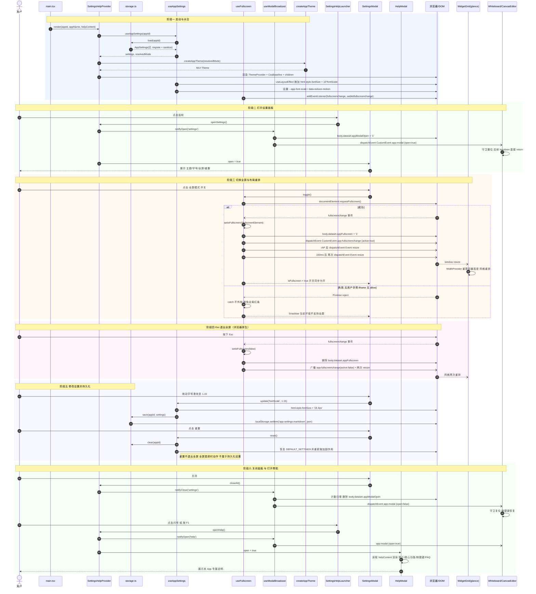
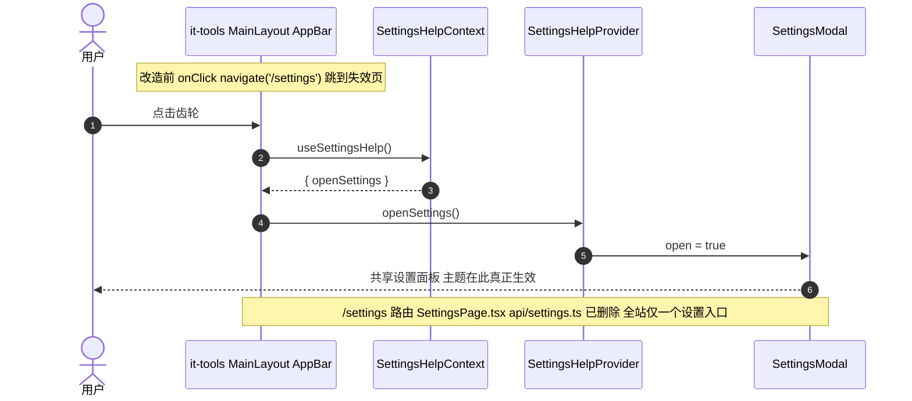
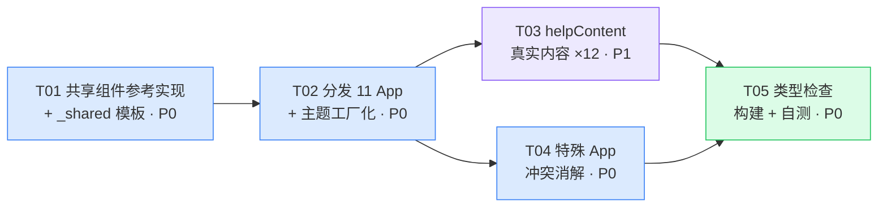

# 设置 + 使用说明 —— 12 克隆 App 共享基础设施设计

> 架构师：高见远（Bob）｜ 版本 v1.0 ｜ 状态：待主理人评审
> 范围：`E:\project\project3\software-clones\` 下 12 个 App（markdown / apiclient / tvtime / excalidraw / photopea / it-tools / kanban / glance / kener / memos / lofi / nonio）

---

## 0. 代码库核对结论（设计前置事实）

设计前已对 12 个工程做了实证扫描，以下事实**已验证**，是本设计的地基：

| # | 结论 | 证据 |
|---|------|------|
| F1 | 12/12 `client/src/` 目录结构同构（`api / components / hooks / layouts / pages / router.tsx / theme.ts / main.tsx / styles`） | 目录列举 |
| F2 | **全仓库仅有 12 处 `import { theme } from './theme'`，且全部位于各自 `main.tsx`** ✅ | `grep` 全仓扫描，无一例外 |
| F3 | `App.tsx` 一律只是 `<RouterProvider router={router} />` 的薄壳 | markdown/App.tsx |
| F4 | kanban 的 `main.tsx` 多一层 `LocalizationProvider`（在 ThemeProvider 内、CssBaseline 外） | kanban/main.tsx |
| F5 | 12/12 `package.json` 已含 `@mui/icons-material@^5.15.0` ✅ | 逐一 grep |
| F6 | glance 用的是 `WidthProvider(GridLayout)`（`components/WidgetGrid.tsx:7`），**WidthProvider 自身监听 window resize** ✅ | 源码 |
| F7 | it-tools 的失效设置由 4 个文件构成：`pages/SettingsPage.tsx`、`api/settings.ts`、`router.tsx`(L6,L20)、`layouts/MainLayout.tsx`(L182/191 侧栏项 + L238/239 AppBar 按钮) | 源码 |
| F8 | excalidraw `Whiteboard.tsx:299` 的 `onKey` 与 photopea `CanvasEditor.tsx:636` 的 `handler` **均已有 INPUT/TEXTAREA/contentEditable 守卫**，但不覆盖 Dialog 内的非输入元素与单键快捷键场景 | 源码 |
| F9 | memos 的 `router.tsx` / `App.tsx` 中**未发现** `RequireAuth` / `Navigate to="/login"` 形式的门禁，门禁应在页面内部或 `authStore.ts` 层 | grep |

**F2 是最重要的一条**：主题工厂化改造的爆炸半径被精确限定为 12 个 `main.tsx`，无隐藏引用，风险等级由"中"降为"低"。

**F6 也很关键**：glance 无需改任何布局文件，`window.dispatchEvent(new Event('resize'))` 即可让 `WidthProvider` 重算宽度。

---

## 1. 实现方案与框架选型

### 1.1 核心技术难点

| 难点 | 决策 |
|---|---|
| D1 12 个独立工程、独立 `node_modules`/vite 配置，无 workspace | **源码复制分发**（12 份同构副本）+ `_shared/settings-help/` 单一真源模板目录 + 同步脚本，**不做跨工程 import** |
| D2 主题需运行时切换，但 `theme` 是模块级静态常量 | `theme.ts` 改为**工厂** `createAppTheme(mode)`；状态上提到 Provider，由 Provider 自持 `ThemeProvider` |
| D3 设置/帮助必须逃逸路由与登录门禁 | 注入点在 `<App/>` **同级**（路由树之外），与 react-router 完全解耦 |
| D4 弹窗输入与画布全局快捷键冲突 | **双通道广播**：`CustomEvent('app:modal')` + `document.body.dataset.appModalOpen`，宿主只加 1 行守卫 |
| D5 全屏后依赖容器尺寸的布局（glance）失效 | `fullscreenchange` → rAF + 150ms 双发 `resize`，覆盖全屏过渡动画期 |
| D6 12 份副本长期漂移 | 副本内**零 App 特化逻辑**；所有差异收敛到 `helpContent.ts` 与 `main.tsx` 的 3 个 props |

### 1.2 架构模式

**Provider + Context + Hooks 的组合根（Composition Root）模式**。

`SettingsHelpProvider` 是一个自洽的组合根：它同时承担
① 设置状态容器（localStorage 持久化）
② MUI `ThemeProvider` 宿主（吃掉主题切换）
③ 副作用执行器（字号、全屏、body data 属性、事件广播）
④ UI 挂载点（悬浮按钮 + 两个 Dialog）

**为什么把 `ThemeProvider` 收进 Provider，而不是在 `main.tsx` 里写 `useState`+`useMemo`？**

需求原文建议在 `main.tsx` 里持有 mode。技术上 `main.tsx` 顶层不能调 Hook，必须额外定义一个 `function Root()` 组件——那就等于**在 12 个 main.tsx 里各写一份完全相同的状态逻辑**，是最容易漂移的地方。收进 Provider 后：

- 12 份 `main.tsx` 的 diff **完全同构**，唯一差异是 `appId` / `appName` / `helpContent` 三个字面量（kanban 多一层 LocalizationProvider）；
- `createAppTheme` 的调用点全仓只剩 1 处（Provider 内），后续调色板改动只改模板；
- 语义等价，需求意图（工厂 + useState/useMemo + 移除静态 import）100% 满足。

> 若主理人坚持"逻辑写在 main.tsx"，备选方案 B 见 §9 待明确事项 Q1。

### 1.3 选型

| 关注点 | 选型 | 说明 |
|---|---|---|
| 弹窗 | MUI `Dialog` | 自带 focus trap、Esc 关闭、Portal 到 `document.body`（在 `documentElement` 全屏下仍可见）|
| 图标 | `@mui/icons-material`（已存在，F5） | 无需新增依赖 |
| 状态 | React Context + `useReducer` | 设置项 <10 个，引入 zustand/jotai 属过度设计 |
| 持久化 | `localStorage` 同步写 | 数据量 <1KB，无需 IndexedDB / 防抖 |
| 主题 | MUI `createTheme` 工厂 + `useMemo` | 沿用现有调色板，仅按 mode 分叉 |
| 字号 | 根 `html` `font-size` 缩放 | MUI v5 typography 默认 rem、Tailwind 默认 rem，一处生效全站 |
| 全屏 | 原生 Fullscreen API + webkit 前缀 | 零依赖 |

### 1.4 关键实现约束（工程师必须遵守）

1. **`theme.ts` 只导出工厂**，禁止再导出 `theme` 常量；改造后须复跑 F2 的 grep，结果必须为 0 处静态引用（处理办法见 §5.6）。
2. **字号缩放必须在 `useLayoutEffect` 中施加**，否则首帧闪烁（`useState` 惰性初始化已保证主题无闪烁）。
3. **不要在 theme 里改 `typography.htmlFontSize`**——那会与 html font-size 缩放叠加，导致双倍放大。
4. **全屏目标固定为 `document.documentElement`**，不得对子元素调用 `requestFullscreen`，否则 Dialog Portal 会被排除在全屏层外而不可见。
5. `requestFullscreen()` 返回 Promise 且**可能 reject**（非用户手势、iframe 无 `allow="fullscreen"`、浏览器策略），必须 `catch` 并降级为 Snackbar 提示，禁止未捕获拒绝（12 个 App 的 `main.tsx` 都装了 `unhandledrejection` 全局横幅，一旦漏 catch 会直接弹红条）。

---

## 2. 文件清单

### 2.1 单一真源模板（新增，1 份）

```
software-clones/_shared/settings-help/            # SSOT，不参与任何工程构建
  ├─ SettingsHelpProvider.tsx
  ├─ SettingsHelpLauncher.tsx
  ├─ SettingsModal.tsx
  ├─ HelpModal.tsx
  ├─ constants.ts
  ├─ types.ts
  ├─ storage.ts
  ├─ index.ts
  ├─ hooks/useAppSettings.ts
  ├─ hooks/useFullscreen.ts
  └─ hooks/useModalBroadcast.ts
software-clones/scripts/sync-settings-help.mjs    # 模板 → 12 App 覆盖同步（幂等）
software-clones/_shared/help/helpContent.template.ts
```

> 同步脚本是 P1，不是 P0。它的价值在于第二次改动：没有它，一个 bug 要手改 12 遍。

### 2.2 每个 App 新增（12 × 12 = 144 个文件）

`<app>` ∈ {markdown, apiclient, tvtime, excalidraw, photopea, it-tools, kanban, glance, kener, memos, lofi, nonio}

```
<app>/client/src/components/SettingsHelp/index.ts                    # 统一出口
<app>/client/src/components/SettingsHelp/types.ts                    # AppSettings / HelpContent / Context 类型
<app>/client/src/components/SettingsHelp/constants.ts                # 事件名 / storage key / 取值区间 / CSS 变量名
<app>/client/src/components/SettingsHelp/storage.ts                  # 读写 + schema 迁移 + 容错
<app>/client/src/components/SettingsHelp/SettingsHelpProvider.tsx    # 组合根（含 ThemeProvider + CssBaseline）
<app>/client/src/components/SettingsHelp/SettingsHelpLauncher.tsx    # 右下角悬浮入口（齿轮 + 问号）
<app>/client/src/components/SettingsHelp/SettingsModal.tsx           # 设置面板
<app>/client/src/components/SettingsHelp/HelpModal.tsx               # 使用说明弹窗
<app>/client/src/components/SettingsHelp/hooks/useAppSettings.ts     # 设置状态 + 持久化 + 副作用施加
<app>/client/src/components/SettingsHelp/hooks/useFullscreen.ts      # 全屏进入/退出/状态同步/resize 广播
<app>/client/src/components/SettingsHelp/hooks/useModalBroadcast.ts  # app:modal 广播 + body dataset
<app>/client/src/help/helpContent.ts                                 # ★ 每 App 内容不同
```

**11 份完全字节一致**（`components/SettingsHelp/**`），**12 份各不相同**（`help/helpContent.ts`）。

### 2.3 每个 App 修改（12 × 2 = 24 个文件）

```
<app>/client/src/main.tsx        # 换注入点；删除 ThemeProvider/CssBaseline/静态 theme 的 import
<app>/client/src/theme.ts        # export const theme  →  export function createAppTheme(mode)
```

### 2.4 特殊 App 额外改动（6 个文件）

```
it-tools/client/src/router.tsx                        # 修改：删 L6 import、删 L20 settings 路由
it-tools/client/src/layouts/MainLayout.tsx            # 修改：L182/191 侧栏项、L238/239 AppBar 按钮 → openSettings()
it-tools/client/src/pages/SettingsPage.tsx            # 删除
it-tools/client/src/api/settings.ts                   # 删除（须先确认无其他引用）
excalidraw/client/src/components/Whiteboard.tsx       # 修改：L300 插入 1 行守卫
photopea/client/src/components/CanvasEditor.tsx       # 修改：L637 插入 1 行守卫
```

**glance / memos / kanban 均无需额外改动**（依据 F6 / F9 / F4，kanban 仅是 main.tsx 的嵌套变体）。

### 2.5 改造后 `main.tsx` 完整示例（标准版，11 个 App 通用）

```tsx
import React from 'react';
import ReactDOM from 'react-dom/client';
import ErrorBoundary from './components/ErrorBoundary';
import App from './App';
import { SettingsHelpProvider } from './components/SettingsHelp';
import { helpContent } from './help/helpContent';
import './styles/global.css';
// ↑ 已移除：import { CssBaseline, ThemeProvider } from '@mui/material';
// ↑ 已移除：import { theme } from './theme';

/** installGlobalErrorGuard 原样保留，此处省略 */
function installGlobalErrorGuard(): void { /* ...不改... */ }
installGlobalErrorGuard();

const rootElement: HTMLElement | null = document.getElementById('root');
if (!rootElement) {
  throw new Error('Root element #root not found');
}

ReactDOM.createRoot(rootElement).render(
  <ErrorBoundary>
    <React.StrictMode>
      <SettingsHelpProvider
        appId="markdown"                    {/* ★ 逐 App 替换，见 §8.1 appId 表 */}
        appName="Markdown 编辑器"            {/* ★ 逐 App 替换 */}
        helpContent={helpContent}
      >
        <App />
      </SettingsHelpProvider>
    </React.StrictMode>
  </ErrorBoundary>
);
```

### 2.6 kanban 变体（唯一差异）

```tsx
      <SettingsHelpProvider appId="kanban" appName="看板" helpContent={helpContent}>
        <LocalizationProvider dateAdapter={AdapterDayjs}>
          <App />
        </LocalizationProvider>
      </SettingsHelpProvider>
```

> `LocalizationProvider` 必须在 `SettingsHelpProvider` **内层**——它需要处于 MUI 主题上下文中。

### 2.7 `SettingsHelpProvider` 的内部渲染结构（契约，工程师照此实现）

```tsx
<MuiThemeProvider theme={muiTheme}>   {/* muiTheme = useMemo(() => createAppTheme(resolvedMode), [resolvedMode]) */}
  <CssBaseline />
  <SettingsHelpContext.Provider value={ctx}>
    {children}                         {/* ← 宿主 App，位于路由树根部之上 */}
    <SettingsHelpLauncher />
    <SettingsModal />
    <HelpModal />
  </SettingsHelpContext.Provider>
</MuiThemeProvider>
```

### 2.8 `theme.ts` 改造契约

```ts
// 改造前：export const theme = createTheme({ palette: { mode: 'light', ... } })
// 改造后：
export type ThemeMode = 'light' | 'dark';
export function createAppTheme(mode: ThemeMode): Theme;
```

- 保留现有全部设计令牌：primary `#3b82f6` / secondary `#8b5cf6` / `shape.borderRadius: 10` / Inter 字体栈 / `MuiPaper` elevation=0 + `backgroundImage: none`。
- dark 分支仅覆写 `background.default`（建议 `#0f1419`）与 `background.paper`（建议 `#161b22`）；primary/secondary 在暗色下对比度达标，**保持不变**，避免 12 个 App 的视觉基线漂移。
- **禁止**导出 `theme` 常量（哪怕是 `export const theme = createAppTheme('light')` 的兼容别名——那会让 F2 的校验永远无法归零）。

---

## 3. 数据结构与接口

### 3.1 TypeScript 接口定义（`components/SettingsHelp/types.ts`）

```ts
/* ---------- 设置 ---------- */
export type ThemeMode = 'light' | 'dark' | 'system';

/** localStorage 持久化载荷。注意：fullscreen 不在其中——它是即时动作，不跨会话恢复。 */
export interface AppSettings {
  /** schema 版本，用于未来迁移。当前恒为 1 */
  version: 1;
  /** 主题模式，默认 'light'（与现状对齐，不改变既有用户观感） */
  themeMode: ThemeMode;
  /** 根字号缩放系数，闭区间 [0.85, 1.30]，步长 0.05，默认 1 */
  fontScale: number;
  /** 降低动效（无障碍），默认 false */
  reduceMotion: boolean;
  /** 未来扩展位：新增设置先落这里，稳定后再提升为一等字段并 bump version */
  extras: Record<string, unknown>;
}

export const DEFAULT_SETTINGS: AppSettings = {
  version: 1,
  themeMode: 'light',
  fontScale: 1,
  reduceMotion: false,
  extras: {},
};

/* ---------- 帮助内容 ---------- */
export interface HelpSection { title: string; items: string[]; }
export interface HelpShortcut { key: string; desc: string; }
export interface HelpFaq { q: string; a: string; }

export interface HelpContent {
  /** 展示名，与 Provider 的 appName 一致 */
  appName: string;
  /** 一句话简介，展示在弹窗标题下方 */
  tagline: string;
  /** 核心功能，2~4 个分组，每组 3~6 条 */
  sections: HelpSection[];
  /** 快捷键；无则省略，HelpModal 自动隐藏该 Tab */
  shortcuts?: HelpShortcut[];
  /** 常见问题；无则省略 */
  faq?: HelpFaq[];
}

/* ---------- Context ---------- */
export interface SettingsHelpContextValue {
  settings: AppSettings;
  /** 解析 'system' 后的实际模式，供 UI 展示当前生效值 */
  resolvedMode: 'light' | 'dark';
  update<K extends keyof AppSettings>(key: K, value: AppSettings[K]): void;
  reset(): void;

  isFullscreen: boolean;
  /** 内部已 catch；失败时通过 Snackbar 提示并 resolve(false) */
  toggleFullscreen(): Promise<boolean>;

  openSettings(): void;
  openHelp(): void;
  closeAll(): void;

  appId: string;
  appName: string;
  helpContent: HelpContent;
}

/* ---------- Provider Props ---------- */
export interface SettingsHelpProviderProps {
  /** 稳定 slug，localStorage 命名空间，见 §8.1 */
  appId: string;
  appName: string;
  helpContent: HelpContent;
  /** 悬浮入口位置，默认 'bottom-right'；与宿主 FAB 冲突时逐 App 覆盖 */
  launcherPosition?: 'bottom-right' | 'bottom-left' | 'top-right';
  /** 是否启用 F1 / Ctrl+, 快捷键，默认 true */
  enableShortcuts?: boolean;
  children: React.ReactNode;
}
```

### 3.2 类图

```mermaid
classDiagram
    direction LR

    class AppSettings {
        <<interface>>
        +1 version
        +ThemeMode themeMode
        +number fontScale
        +boolean reduceMotion
        +Record extras
    }

    class HelpContent {
        <<interface>>
        +string appName
        +string tagline
        +HelpSection[] sections
        +HelpShortcut[] shortcuts
        +HelpFaq[] faq
    }
    class HelpSection {
        <<interface>>
        +string title
        +string[] items
    }
    class HelpShortcut {
        <<interface>>
        +string key
        +string desc
    }
    class HelpFaq {
        <<interface>>
        +string q
        +string a
    }

    class SettingsStorage {
        <<module>> storage.ts
        +load(appId) AppSettings
        +save(appId, s) void
        +clear(appId) void
        -migrate(raw) AppSettings
        -sanitize(s) AppSettings
    }

    class useAppSettings {
        <<hook>>
        -AppSettings state
        +update(key, value) void
        +reset() void
        +resolvedMode() light|dark
        -applyFontScale(scale) void
        -applyReduceMotion(on) void
        -persist() void
    }

    class useFullscreen {
        <<hook>>
        -boolean isFullscreen
        +enter() Promise
        +exit() Promise
        +toggle() Promise
        -onFullscreenChange() void
        -broadcastResize() void
    }

    class useModalBroadcast {
        <<hook>>
        -number openCount
        +notifyOpen(source) void
        +notifyClose(source) void
        -setBodyFlag(on) void
        -dispatchAppModal(open) void
    }

    class SettingsHelpProvider {
        <<component>>
        +appId string
        +appName string
        +helpContent HelpContent
        +launcherPosition string
        +enableShortcuts boolean
        -muiTheme Theme
        -render() JSX
    }

    class SettingsHelpContext {
        <<React.Context>>
        +SettingsHelpContextValue value
    }

    class createAppTheme {
        <<factory>> theme.ts
        +createAppTheme(mode) Theme
    }

    class SettingsHelpLauncher {
        <<component>>
        -onGearClick() void
        -onHelpClick() void
    }
    class SettingsModal {
        <<component>>
        -renderThemeToggle() JSX
        -renderFontScaleSlider() JSX
        -renderFullscreenSwitch() JSX
        -renderResetButton() JSX
    }
    class HelpModal {
        <<component>>
        -renderSections() JSX
        -renderShortcuts() JSX
        -renderFaq() JSX
    }

    class HostApp {
        <<existing>> App.tsx
        +RouterProvider
    }
    class KeyboardHost {
        <<existing>>
        Whiteboard.tsx / CanvasEditor.tsx
        -onKeyDown(e) void
    }
    class WidgetGrid {
        <<existing>> glance
        WidthProvider(GridLayout)
        -onWindowResize() void
    }

    HelpContent *-- HelpSection
    HelpContent o-- HelpShortcut
    HelpContent o-- HelpFaq

    SettingsHelpProvider ..> useAppSettings : uses
    SettingsHelpProvider ..> useFullscreen : uses
    SettingsHelpProvider ..> useModalBroadcast : uses
    SettingsHelpProvider ..> createAppTheme : calls with resolvedMode
    SettingsHelpProvider --> SettingsHelpContext : provides
    SettingsHelpProvider *-- SettingsHelpLauncher
    SettingsHelpProvider *-- SettingsModal
    SettingsHelpProvider *-- HelpModal
    SettingsHelpProvider o-- HostApp : renders as children
    SettingsHelpProvider o-- HelpContent : prop

    useAppSettings ..> SettingsStorage : load/save
    useAppSettings ..> AppSettings : owns

    SettingsHelpLauncher ..> SettingsHelpContext : consume
    SettingsModal ..> SettingsHelpContext : consume
    HelpModal ..> SettingsHelpContext : consume
    HostApp ..> SettingsHelpContext : consume (it-tools AppBar)

    useModalBroadcast ..> KeyboardHost : window CustomEvent app:modal + body dataset
    useFullscreen ..> WidgetGrid : window Event resize
```

---

## 4. 调用流程（时序图）

### 4.1 主流程：启动 → 打开设置 → 切全屏 → 布局重排 → 打开帮助



### 4.2 分支流程：it-tools AppBar 原生入口收编



---

## 5. 特殊 App 冲突消解（逐一给出方案）

### 5.1 it-tools —— 吸收/替换现有 `/settings`

现状（F7）：`/settings` 路由页把 theme 存到后端 KV 再 `reload`，但 `theme.ts` 硬编码 light，**永远不生效**；且存在**两个入口**（侧栏项 L182/191 + AppBar 按钮 L238/239）。

改动清单：

| 文件 | 动作 | 细节 |
|---|---|---|
| `pages/SettingsPage.tsx` | **删除** | 整文件 |
| `api/settings.ts` | **删除** | 删前先 `grep -rn "api/settings\|settingsApi" it-tools/client/src`，确认仅 SettingsPage 引用；若后端 `/api/settings` 被其他能力复用则**保留文件、仅删前端引用** |
| `router.tsx` | **修改** | 删 L6 `import SettingsPage`、删 L20 `{ path: 'settings', element: <SettingsPage /> }` |
| `layouts/MainLayout.tsx` | **修改** | ① 侧栏项（L182 `to="/settings"`）：改为 `<ListItemButton onClick={openSettings}>`，去掉 `component={Link} to`；② AppBar 按钮（L238）：`onClick={() => navigate('/settings')}` → `onClick={openSettings}`；③ 顶部 `const { openSettings } = useSettingsHelp();`；④ 保留 `SettingsIcon` import |

补充决策：**it-tools 保留侧栏 + AppBar 两个原生入口指向同一个共享面板**（它们本来就是同一入口的两种呈现），同时**将 `launcherPosition` 保持默认**——但由于已有原生入口，建议给 it-tools 传 `launcherPosition="bottom-left"` 或在自测阶段确认悬浮齿轮是否冗余（见 §9 Q3）。

风险：删除路由后，用户书签 `/settings` 会命中 `errorElement`。**兜底**：在 `router.tsx` 保留一条 `{ path: 'settings', element: <Navigate to="/" replace /> }` 重定向（推荐，成本 1 行）。

### 5.2 excalidraw / photopea —— 键盘守卫

事件契约：`app:modal`，`CustomEvent<{ open: boolean; source: 'settings' | 'help' }>`，派发在 `window` 上。
同时 Provider 会维护 `document.body.dataset.appModalOpen = '1' | 删除`（**引用计数**，两个弹窗同时开时不会提前清零）。

**推荐用 body dataset 做守卫**——它是同步真值，不需要 `useEffect` + `useRef` 订阅，改动量真正做到 1 行，且不受 StrictMode 双挂载影响。

**excalidraw** `client/src/components/Whiteboard.tsx`，在 L299 `const onKey = (e: KeyboardEvent) => {` 之后插入：

```ts
      if (document.body.dataset.appModalOpen === '1') return;   // ← 新增（共 1 行）
```

**photopea** `client/src/components/CanvasEditor.tsx`，在 L636 `const handler = (e: KeyboardEvent): void => {` 之后插入同一行。

> 二者原有的 `INPUT / TEXTAREA / isContentEditable` 守卫**全部保留**，本行是叠加的外层守卫。
> photopea 尤其必要：它有 `v/b/e/r/o/l/t` 等**单字母**快捷键，用户在帮助弹窗里做文本选择/在设置面板里按键都可能误触。
> 若工程师偏好事件订阅方式，`useModalBroadcast` 同时派发 `app:modal`，两种方式等价可选，但**不要两种都写**。

### 5.3 glance —— 全屏后网格重排

依据 **F6**：`WidgetGrid.tsx:7` 使用 `WidthProvider(GridLayout)`，`WidthProvider` 内部已监听 `window.resize` 并重算容器宽度。

**结论：`DashboardLayout.tsx` 与 `WidgetGrid.tsx` 均无需修改。** 重排逻辑挂在共享侧 `useFullscreen`：

- 在 `fullscreenchange` 回调里，`requestAnimationFrame(() => window.dispatchEvent(new Event('resize')))`；
- 再加一次 `setTimeout(..., 150)` 兜底——全屏切换在部分浏览器有过渡动画，rAF 时刻容器尺寸可能尚未稳定；
- 额外派发 `app:fullscreenchange` CustomEvent，供未来有自定义重排需求的 App 订阅。

自测项：进入全屏后 widget 是否铺满、拖拽/缩放手柄坐标是否正确、退出全屏后是否复原。

### 5.4 memos —— 确认无需额外改动

注入点在 `<App/>` 同级、路由树之上，登录门禁位于路由/页面内部（F9），因此设置与帮助**不受门禁影响**：未登录时点齿轮仍可切主题、调字号、进全屏。

唯一注意：memos 的登录页也会被主题影响——这是**期望行为**，需在自测清单中确认登录页暗色下文字对比度正常。

### 5.5 kanban —— 仅 main.tsx 嵌套变体

见 §2.6。`LocalizationProvider` 移到 `SettingsHelpProvider` 内层即可，无其他改动。

### 5.6 静态 `theme` 引用的校验与处理

**校验命令（改造后必须归零）**：

```bash
cd E:/project/project3/software-clones
grep -rn "import[^;]*\btheme\b[^;]*from '\..*theme'" --include=*.ts --include=*.tsx */client/src/ \
  | grep -v createAppTheme
# 期望输出：空
```

**若发现残留引用**，按以下优先级处理：

1. 该文件在 React 组件树内 → 改用 `useTheme()`（`@mui/material/styles`），这是唯一正确解；
2. 该文件是非组件工具函数（如 canvas 绘制取色）→ 把颜色作为参数传入，由调用方 `useTheme()` 后传递；
3. 确实无法进入组件上下文（如模块顶层常量表）→ 抽出**与 mode 无关的裸令牌**到 `theme.tokens.ts`（颜色 hex、圆角、字体栈），双方共用，**不得** import 已构建的 Theme 对象。

> 依据 F2，当前实测残留为 **0**，上述流程为回归防线。

---

## 6. 任务列表（有序，含依赖）

> 遵循任务分解硬约束：**共 5 个任务**，按功能层次分组，不按单文件拆分。
> 与需求原文 ①~⑥ 的映射：T01=①+部分③、T02=②+③、T03=④、T04=⑤、T05=⑥。

### T01 共享组件参考实现 + 单一真源模板 【P0】【依赖：无】

在 **markdown** 这一个 App 内做出**可运行的参考实现**并跑通，再抽为模板。选 markdown 是因为它无画布快捷键、无门禁、无网格布局，干扰最小。

涉及文件：
```
_shared/settings-help/{types,constants,storage,index}.ts
_shared/settings-help/{SettingsHelpProvider,SettingsHelpLauncher,SettingsModal,HelpModal}.tsx
_shared/settings-help/hooks/{useAppSettings,useFullscreen,useModalBroadcast}.ts
_shared/help/helpContent.template.ts
scripts/sync-settings-help.mjs
markdown/client/src/components/SettingsHelp/**        （11 个文件，模板落地）
markdown/client/src/help/helpContent.ts
markdown/client/src/theme.ts                          （改：工厂化）
markdown/client/src/main.tsx                          （改：新注入点）
```
验收：markdown 可切亮/暗、字号 0.85~1.30 生效、全屏进出与 Esc 状态同步、刷新后设置保持、重置可用、`tsc --noEmit` 与 `vite build` 通过。

---

### T02 分发到其余 11 个 App + 主题工厂化全量改造 【P0】【依赖：T01】

涉及文件：
```
{apiclient,tvtime,excalidraw,photopea,it-tools,kanban,glance,kener,memos,lofi,nonio}/client/src/components/SettingsHelp/**   （11×11 = 121 文件）
{以上 11 个}/client/src/help/helpContent.ts            （占位骨架：appName + tagline + 1 个 section）
{以上 11 个}/client/src/theme.ts                       （改：工厂化）
{以上 11 个}/client/src/main.tsx                       （改：新注入点；kanban 用 §2.6 变体）
```
关键点：`components/SettingsHelp/**` 必须与 markdown 版**字节一致**（用 `sync-settings-help.mjs` 生成，不要手抄）；改完立即跑 §5.6 的静态 theme 校验。

---

### T03 逐 App 填充 helpContent 真实内容 【P1】【依赖：T02】

涉及文件（12 份，各不相同）：
```
markdown/client/src/help/helpContent.ts      apiclient/client/src/help/helpContent.ts
tvtime/client/src/help/helpContent.ts        excalidraw/client/src/help/helpContent.ts
photopea/client/src/help/helpContent.ts      it-tools/client/src/help/helpContent.ts
kanban/client/src/help/helpContent.ts        glance/client/src/help/helpContent.ts
kener/client/src/help/helpContent.ts         memos/client/src/help/helpContent.ts
lofi/client/src/help/helpContent.ts          nonio/client/src/help/helpContent.ts
```
内容基线（每 App）：`tagline` 1 句；`sections` ≥2 组、每组 3~6 条；`shortcuts` 按实际——**excalidraw / photopea 必须完整列出**（源码已有明确快捷键表，直接照抄：excalidraw 的 Ctrl+Z/Y、Delete、Esc、方向键微调；photopea 的 v/b/e/r/o/l/t + Ctrl+Z/Y/S）；`faq` ≥2 条。内容须与源码实际能力一致，禁止臆造功能。

---

### T04 特殊 App 冲突消解 【P0】【依赖：T02】（可与 T03 并行）

涉及文件：
```
it-tools/client/src/router.tsx                     （改：删 import + 路由，加 /settings → / 重定向）
it-tools/client/src/layouts/MainLayout.tsx         （改：侧栏项 + AppBar 按钮 → openSettings）
it-tools/client/src/pages/SettingsPage.tsx         （删）
it-tools/client/src/api/settings.ts                （删，删前确认引用）
excalidraw/client/src/components/Whiteboard.tsx    （改：L300 加 1 行守卫）
photopea/client/src/components/CanvasEditor.tsx    （改：L637 加 1 行守卫）
```
glance / memos / kanban 在本任务中**只做验证不改代码**（依据 F6/F9/F4）。

---

### T05 全量类型检查、构建与自测 【P0】【依赖：T03, T04】

涉及文件：`docs/settings-help-qa-checklist.md`（新增）+ 缺陷回改（回流至 `_shared/` 模板后重新同步，**禁止只改单个 App**）。

必做校验：
1. 12 × `tsc --noEmit` 全绿；12 × `vite build` 全绿；
2. §5.6 静态 theme 引用 grep = 0；
3. 12 × `components/SettingsHelp/` 目录哈希一致性比对（防漂移）；
4. 逐 App 手工清单：亮/暗切换 → 字号三档 → 全屏进出 + Esc → 刷新持久化 → 重置 → 帮助弹窗内容正确 → 悬浮按钮不遮挡宿主关键 UI；
5. 专项：excalidraw/photopea 在弹窗内打字不触发画布动作；glance 全屏后网格铺满且退出复原；memos 未登录态可用设置；it-tools 无第二个设置入口、`/settings` 书签不报错；kanban 日期选择器仍正常。

### 任务依赖图



---

## 7. 依赖包

**无需新增任何 npm 依赖。** 已核验（F5）12/12 工程均具备：

```
react@^18.2.0                  Context / Hooks
@mui/material@^5.15.0          Dialog / Switch / Slider / Snackbar / Fab / ThemeProvider / CssBaseline / createTheme
@mui/icons-material@^5.15.0    SettingsOutlined / HelpOutline / Fullscreen / FullscreenExit / RestartAlt
@emotion/react + @emotion/styled  MUI 样式引擎
typescript@^5.3                类型
```

全屏使用**浏览器原生 Fullscreen API**，字号缩放使用**原生 DOM style**，持久化使用**原生 localStorage**，均无依赖。

> 建议明确拒绝的候选：`react-fullscreen`（包装薄、维护弱）、`zustand`（状态规模不匹配）、`use-local-storage-state`（12 份复制场景下，自持 30 行 storage.ts 比多一个依赖更可控）。

---

## 8. 共享约定（跨文件契约，集中定义于 `constants.ts`）

### 8.1 appId 表（localStorage 命名空间，禁止随意改动）

| App | appId | 建议 appName |
|---|---|---|
| markdown | `markdown` | Markdown 编辑器 |
| apiclient | `apiclient` | API 调试客户端 |
| tvtime | `tvtime` | 追剧管理 |
| excalidraw | `excalidraw` | 白板 |
| photopea | `photopea` | 图像编辑器 |
| it-tools | `it-tools` | 开发者工具箱 |
| kanban | `kanban` | 看板 |
| glance | `glance` | 仪表盘 |
| kener | `kener` | 状态监控 |
| memos | `memos` | 速记 |
| lofi | `lofi` | Lofi 播放器 |
| nonio | `nonio` | 内容社区 |

### 8.2 常量清单

```ts
/** localStorage —— 按 appId 分命名空间 */
export const STORAGE_KEY_PREFIX = 'app-settings:';
export const storageKey = (appId: string) => `${STORAGE_KEY_PREFIX}${appId}`;
// 实例：'app-settings:markdown'、'app-settings:it-tools'
export const SETTINGS_VERSION = 1;

/** 自定义事件名 —— 全部以 app: 前缀，避免与宿主/三方库冲突 */
export const APP_EVENTS = {
  /** CustomEvent<{open:boolean; source:'settings'|'help'}> 弹窗开合，供画布类 App 守卫快捷键 */
  MODAL: 'app:modal',
  /** CustomEvent<{active:boolean}> 全屏状态变化 */
  FULLSCREEN_CHANGE: 'app:fullscreenchange',
  /** CustomEvent<AppSettings> 设置变更，供非 React 消费者 */
  SETTINGS_CHANGE: 'app:settingschange',
  /** Event 外部命令式打开设置（无 React 上下文时的逃生口） */
  OPEN_SETTINGS: 'app:open-settings',
  /** Event 外部命令式打开帮助 */
  OPEN_HELP: 'app:open-help',
} as const;

/** body data-* 标记 —— 同步真值，守卫首选 */
export const BODY_FLAGS = {
  MODAL_OPEN: 'appModalOpen',   // <body data-app-modal-open="1">
  FULLSCREEN: 'appFullscreen',  // <body data-app-fullscreen="1">
  REDUCE_MOTION: 'appReduceMotion',
} as const;

/** CSS 变量 —— 定义在 documentElement 上 */
export const CSS_VARS = {
  FONT_SCALE: '--app-font-scale',   // 数值，如 '1.15'
  BASE_FONT_PX: '--app-base-font',  // 如 '18.4px'
} as const;

/** 字号缩放 */
export const FONT_SCALE_MIN = 0.85;
export const FONT_SCALE_MAX = 1.30;
export const FONT_SCALE_STEP = 0.05;
export const FONT_SCALE_DEFAULT = 1;
export const BASE_FONT_PX = 16;      // html font-size = BASE_FONT_PX * fontScale

/** 全屏后触发重排的时序 */
export const RESIZE_BROADCAST_DELAYS = [0 /* rAF */, 150 /* ms 兜底 */] as const;

/** 快捷键 */
export const SHORTCUT_HELP = 'F1';
export const SHORTCUT_SETTINGS = 'Ctrl/Cmd + ,';
```

### 8.3 行为约定

1. **`app:modal` 使用引用计数**：Provider 内维护 `openCount`，`0 → 1` 时派发 `{open:true}` 并置 body 标记，`1 → 0` 时派发 `{open:false}` 并清除。禁止每个 Dialog 各自派发。
2. **z-index 层级**：悬浮入口用 `theme.zIndex.speedDial`（1050），低于 Drawer(1200) 与 Modal(1300)，保证不遮挡宿主抽屉、不盖住自身弹窗。
3. **快捷键注册用捕获阶段**（`addEventListener('keydown', h, true)`），确保 F1 / Ctrl+, 能抢在画布监听之前；且当焦点在 INPUT/TEXTAREA/contentEditable 时不响应。
4. **localStorage 读取必须全程容错**：`try/catch` 包裹（隐私模式下 `localStorage` 可能抛错）+ JSON 解析失败回落 `DEFAULT_SETTINGS` + `sanitize()` 钳制 `fontScale` 到区间、校验 `themeMode` 枚举。**任何情况下不得因存储损坏导致白屏。**
5. **`fontScale` 只改 `html` 的 `font-size`**，同时写 `--app-font-scale` 供自定义 CSS 使用；**不改** `theme.typography.htmlFontSize`（避免双倍缩放）。
6. **`reduceMotion`** 置位时写 `<body data-app-reduce-motion="1">`，并在 `createAppTheme` 之外通过 `theme.transitions.create` 短路（`transitions: { duration: { ...全部为 0 } }` 的浅覆盖），实现成本约 5 行。
7. **`extras` 字段是唯一的扩展入口**：新增设置项先进 `extras`，两个版本后再提升为一等字段并 bump `SETTINGS_VERSION` + 写 `migrate` 分支。
8. **12 份副本零特化**：任何"只有某个 App 需要"的逻辑，一律通过 Provider props 暴露（如 `launcherPosition`），**不允许**在某份副本里写 `if (appId === 'xxx')`。

---

## 9. 待明确事项（需主理人/用户拍板）

| # | 事项 | 我的建议 | 影响面 |
|---|---|---|---|
| **Q1** | 主题状态放 `SettingsHelpProvider` 内（方案 A，本设计采用）还是按需求原文放 `main.tsx` 的 `Root` 组件里（方案 B）？ | **A**。B 会在 12 个 main.tsx 里复制同一段状态逻辑，是漂移的最大来源；A 语义等价且 diff 同构 | 12 × main.tsx 的改造形态 |
| **Q2** | `themeMode` 是否需要 `'system'`（跟随系统）？本设计已含，默认仍为 `'light'` 以保持现状 | **保留 system**，成本约 8 行（`matchMedia` 监听），是现代应用的基本期待 | SettingsModal UI 从 2 选项变 3 选项 |
| **Q3** | it-tools 已有侧栏 + AppBar 两个原生入口，是否还需要右下角悬浮齿轮？ | **隐藏悬浮齿轮的设置按钮、保留问号**（新增 prop `hideSettingsLauncher`）——但这会破坏"零特化"原则，故需拍板 | it-tools 的 main.tsx 多 1 个 prop |
| **Q4** | 悬浮入口固定右下角，是否与某些 App 的既有 FAB/工具条冲突？（excalidraw 工具条、photopea 图层面板、lofi 播放控件尚未逐一验证） | 先按默认 `bottom-right` 实施，**T05 自测阶段逐 App 确认**，冲突者改传 `launcherPosition` | 最多 12 处一行 prop |
| **Q5** | it-tools 后端 `/api/settings` KV 接口：仅前端弃用，还是连服务端路由一起清理？ | **仅弃用前端**，服务端保留（可能被其他用途或测试引用），避免跨端连带风险 | it-tools/server |
| **Q6** | 帮助内容的语言与详略：全中文？多长？是否需要图片/GIF？ | **全中文、纯文本、无图**。每 App 控制在 tagline 1 句 + 2~4 组 × 3~6 条 + 2~5 条 FAQ，弹窗内一屏半以内 | T03 工作量 |
| **Q7** | 是否引入 `_shared/` + 同步脚本（P1）？不引入则 12 份靠人工同步 | **强烈建议引入**。脚本约 40 行，第一次修 bug 就回本 | 新增 2 个文件 |
| **Q8** | 12 个 App 未来是否会同域部署（反代到 `/markdown`、`/kanban` 等）？ | 已按"会"设计（localStorage 按 appId 分命名空间），若确认永不同域也无害 | 无（决策已内建） |

---

## 10. 风险登记

| 风险 | 等级 | 缓解 |
|---|---|---|
| 12 份副本长期漂移 | 中 | `_shared` SSOT + 同步脚本 + T05 目录哈希比对 |
| 暗色模式下宿主组件存在硬编码浅色（内联 style / Tailwind 的 `bg-white`、`text-gray-900`） | **中高** | T05 逐 App 目视检查；本期只修**影响可读性**的（对比度不足），装饰性差异记入待办，不在本期扩大范围 |
| `requestFullscreen` 被浏览器策略拒绝 → 触发全局红色错误横幅 | 中 | `useFullscreen` 内部强制 catch，降级 Snackbar（已列为 §1.4 硬约束 5） |
| photopea/excalidraw 画布尺寸依赖窗口 → 全屏后画布不重算 | 中 | 二者已监听 window resize 则自动生效；T05 需实测，若未监听则在各自组件加 resize 订阅（届时属计划外改动，需回报） |
| `<React.StrictMode>` 下 effect 双执行导致事件重复注册 | 低 | 所有 `addEventListener` 必须在 cleanup 中成对 `removeEventListener`；引用计数用 ref 而非 state |
| Tailwind preflight 与 MUI CssBaseline 在暗色下的背景冲突 | 低 | CssBaseline 在 ThemeProvider 内、优先级更高；T05 确认 `<body>` 背景随主题变化 |


